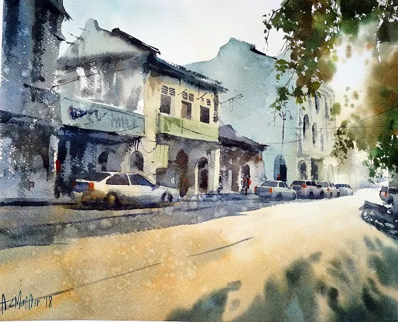

import Map from '../common/map.astro'

My great grandfather was Tam Yong (father of towkay Tan Yee Man), Kapitan China of Seremban. According to [Wikipedia](https://en.wikipedia.org/wiki/Kapitan_Cina):

> Kapitan Cina, also spelled Kapitan China or Capitan China (English: Captain of the Chinese; Chinese: 華人甲必丹; pinyin: Huárén Jiǎbìdān; Dutch: Kapitein der Chinezen), was a high-ranking government position in the civil administration of colonial Indonesia, Malaysia, Singapore, Borneo and the Philippines. Office holders exercised varying degrees of power and influence: from near-sovereign political and legal jurisdiction over local Chinese communities, to ceremonial precedence for community leaders.

I am greatly indebted to the [森美蘭譚氏聯宗會 The N.S. Tham Clansmen Association](https://tamclansmen.blogspot.com/2009/06/history-of-kapitan-tham-yong.html) for providing information about my great grandfather.

## Birthplace

My great grandfather originated from the Dragon Mouth Village of Changsha Township by Kaiping District in the Province of GuangDong. A genealogy expert has helped locate it for me. Changsha is an island - it looks like this today on Apple maps.

## Extract from "Twentieth Century Impressions of British Malaya"

Extract from the book "Twentieth Century Impressions of British Malaya" - an entry about my great grandfather. Thank you to Jack Tham for sending this to me. What is totally amazing is I remember the house in the picture!!! Visited it as a small child. Demolished to make way for the KL Seremban freeway exit to present day Seremban.

### Towkay Tam Yong

The fact that Towkay Tam Yong has for many years represented Chinese interests in the State Council of the Negri Sambilan testifies to the high esteem in which he is held. A native of Canton, he came to the Federated Malay States some thirty-three years ago and joined a relative who had already established himself in business in that country. His father was a merchant in the Kwangtung Province of China and member of a well-known family in the Two Kwang. During his early stay in the Negri Sambilan, Mr. Tam Yong was very successful as a merchant. Subsequently he purchased land and planted it as a coffee estate. Later on he became proprietor of a brick-kiln, and undertook several important Government contracts, amongst which was the building of the gaol at Seremban. Mr. Tam Yong, whose home is in Seremban, became a member of the State Council in 1898, and at present is the only Chinese member of that body. Most of his business concerns now are in the Negri Sambilan. He has six sons and six daughters. His eldest son was educated in Singapore.

## Epitaph

The following is taken from an epitaph erected by The N.S. Tham Clansmen Association:

> Kapitan Tham Yong, also known as Tham Tuck Thong and Tham Onn Yong, was a Chinese leader in Negeri Sembilan during the late 19th Century.
>
> He was born in China during the end of the Ching Dynasty, he left his homeland in Dragon Mouth Village of Changsha Township by Kaiping District in the Province of GuangDong, and sailed to Malaya in search of a new life.
>
> As a humble and kind hearted man, he believed in honesty and the virtues of frugality. He worked his way to become a prominent tin miner in Seremban and was highly regarded by the British Colonial Government as well as the local community. As a result of this achievement, he was conferred a Chinese Kapitan. He died on on 8th August 1913 at the age of 57.
>
> Kapitan Tham Yong made significant contributions to the revolutionary affairs of Dr. Sun Yat Sen, in addition to the Chinese community in Negeri Sembilan. In his endeavors, he donated a piece of land at Jalan Temiang in Seremban to build the Chinese Maternity Hospital for the poor and needy. (The hospital was later converted to Wah Chai Association which handiest matters in relation to Chinese burial grounds.) He also donated one acre of land at Bukit Rase, Seremban to house a Chinese cemetery (now the main graveyard of the Tham Clan of HongYang); managed by the Tham Clan Association.
>
> After the independence of Malaya, the local Government changed the name of Murray Street in Seremban to Jalan Kapitan Tham Yong in honour of his numerous contributions to the country.
>
> With the consent of his descendants, The Tham Clansmen Association of Malaysia and The N.S. Tham Clansmen Association had decided to move the late Kapitan Tham Yong and his wife’s grave to the main burial ground of HongYang Tham Clan, thereby marking the area as a piece of homage for the future generation.
>
> Erected by
> The N.S. Tham Clansmen Association
> The Tham Clansmen Association of Malaysia
> On 2nd May 1999

## Jalan Kapitan Tam Yeong

Today, there is a street named after my great grandfather. Jalan Kapitan Tam Yeong is a road on the northern part of downtown Seremban (formerly part of Murray St). It connects Jalan Tun Dr Ismail to Jalan Leftenan Adnan. In between, it also forms junctions with Jalan Dato Bandar Tunggal, Jalan Seng Meng Lee and Jalan Yam Tuan.

<Map loc={[2.72986, 101.93829]} zoom={18} />

This watercolour painting of Japan Kapitan Tam Yeong is by [Azman Nor](https://azmannor.com)

Some information on Kapitan Tam Yong are reported contained in the Negeri Sembilan Chinese Heritage Museum, located on the 2nd floor of the Negeri Sembilan Chinese Assembly Hall (NSCAH), was established on April 16, and took almost three years to be ready to welcome visitors. It is open to the public daily except Mondays, from 11 am to 5 pm.
