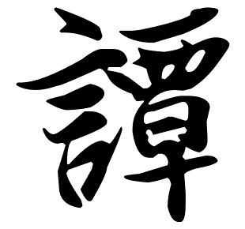

import Map from '../common/map.astro'

The surname Tham (譚) is pronounced and romanised differently in different languages and dialects:

- Tan (Hokkien Chinese and Mandarin Chinese)
- Tan (Japanese)
- Dam (Korean)
- Đàm (Vietnamese)
- Tam (Cantonese Chinese and Hakka Chinese)
- Tham (Hokkien Chinese and Teochew Chinese)
- Ham, Hom, Hum, Tom, Thom (Toisanese Chinese)

The standard Hanyu Pinyin romanisation is **Tan** and it is pronounced _Taam4_ (Jyutping romanisation) in Cantonese.

According to [Wikipedia](<https://en.wikipedia.org/wiki/Tan_(surname)>), it is the 56th most common Chinese surname.

## Early History

The earliest known Tan is King Tan (Tan Gong 谭公) who appeared in the Book of Odes [Shih-ching](https://en.wikipedia.org/wiki/Classic_of_Poetry). He ruled over the State of Sung (Sung kuo 宋國), married Zhuang Jiang (庄姜) and was appointed a Viscount in the Zhou (周) Dynasty. The surname Tan became a hereditary surname to be passed down to descendants. He also became known as Tan Zi.

King Tan established the Tan Kingdom, which was situated in the current Shandong Province Ji Nan (山东省济南) (Li City) (历城), 70 miles east South of Long Shan Township (龙山镇). That is about 2 miles east/north of the Long Shan Station of the Jiao Ji Railway Line (龙山胶济铁路). It is also name as Dong Ping Ling District (东平陵县) or Ping Ling District (平陵县). It was pronounced as a Royal Kingdom by Han Wen Di (汉文帝) after ruling it for 16 years.

<Map loc={[36.668333, 116.997222]} zoom={10} />

However, the Kingdom was abolished when Tai Zong Zhen Guang from the State of Chü (齊國) defeated the Tan state. The descendants of the Tan family fled, mainly to the provinces of Guangdong and He Nan. The writing of the surname was also changed from 談 to 譚 to avoid pursuit by enemies.

## The Tham clan

Today, there are over 1 million members of the Tan clan spread across the world, including Malaysia and Australia. Many Tan people identify as Taishanese (台山) or Sze Yup people (四邑廣東人).

## Reference

According to [_In Search of Your Asian Roots: Genealogical Research on Chinese Surnames_](https://books.google.com/books?id=t26Iv0Octa0C) by Sheau-yueh J Chao [ISBN 0-8063-4946-8, Clearfield Co/Genealogical Publishing Co, Baltimore, 2000] page 170[^1]:

> ### 478. T'an2 譚
>
> The surname T'an (譚) came from two sources: 1. Yüan ho hsing tsuan traces the origin of the surname T'an (譚) as follows: the surname derivd [sic] from the name of the feudal territory, the State of T'an (T'an kuo 譚國) in the Spring and Autumn (Ch'un ch'iu 春秋) Period. After the State of T'an was defeated by the State of Chü (齊國), its descendants formally adopted T'an as their common surname. The family initially settled in Shan-tung (山東) and later prospered in Hu-nan (湖南) provinces. 2. The surname T'an (譚) branched from the surname T'an (談) due to a change of character for the name to avoid revenge of the family by the rivals.
>
> _See also T'an2 談._
>
> Notes:
> 19 strokes
> Ling, Pao. (T'ang dynasty). Yüan ho hsing tsuan. 4 vols. T'ai-pei: Shang wu yin shu kuan, 1975.
>
> ### 479. T'an2 談
>
> The surname T'an (談) derived from the following two sources: 1. According to Ch'ien chia hsing, the eldest son of the Shang (商) king Ti-i (帝乙) whose name was Wei Tzu-ch'i (微子) ? was bestowed with the feudal territory of the State of Sung (Sung kuo 宋國) by Chou Wu-wang (周武王). Thirty-six generations later, the State of Sung was ruled by T'an Chün (談公) after he defeated the State of Ch'u (Ch'u kuo 楚國) and T'an was adopted as a common surname by his descendants. 2. The surname T'an follows the ancestral line of Chi T'an (籍談) who was a grand master (ta-fu 大夫) in the Chou (周) dynasty. His descendants initially adopted the surname T'an (談) but later changed to T'an (譚) after the family escaped from the homeland to avoid revenge by the rivals.
>
> _See also Chi2 籍, T'an2 譚._
>
> Notes:
> 15 strokes
> Yang, Ta-ch'u. Ch'ien chia hsing. Hon-kong: San jung hsing hao, 1923.

[^1]: The earliest study on the origin of Chinese surnames. The work is arranged according to the rhyme of the names and the major emphasis of the book is placed on the surnames which were most common during the T'ang dynasty. It is a study of particular importance for students and scholars of that period. For reference and scholarly use. There may be typographical and historical errors in these extracts.

For more information, please refer to [History of the Tam's Clansmen](http://tamhistory.blogspot.com/).
