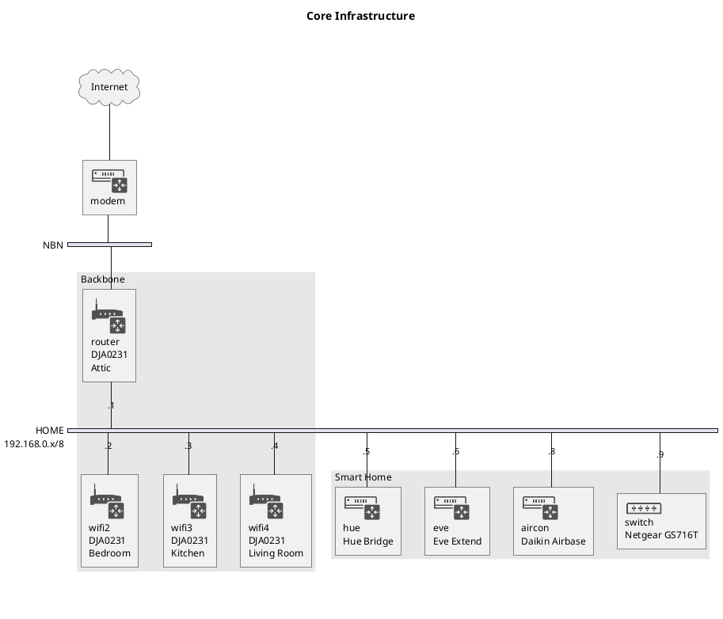
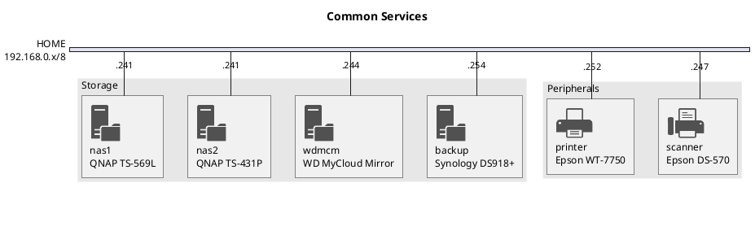
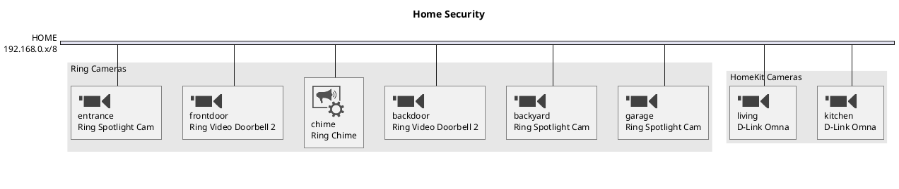

I've finally decided to reconfigure our home network to use purely Telstra
Smart Modems (Gen 2) as the backbone and wi fi infrastructure.

## Commands to configure modems

This assumes the modem has root access enabled as per
[Hacking Technicolor Gateways](https://hack-technicolor.readthedocs.io/en/stable/).

I have 4 Telstra Smart Modems (Gen 2) - model DJA0231 made by Technicolor. These
can easily be hacked to provide root access using
[tch-exploit](https://github.com/BoLaMN/tch-exploit)

The specs are:

| Category   | Specification               |
| ---------- | --------------------------- |
| Wi-Fi      | 802.11ac                    |
|            | Dual Band Concurrent Wi-Fi  |
|            | 4x4 2.4ghz, 4x4 5ghz        |
| LTE-Backup | Yes – Voice & Data          |
| Voice      | 2x FXS ports                |
| Capability | Bandsteering                |
|            | Automatic Channel Selection |
|            | WPS                         |
|            | Wi-Fi Dr enabled            |
| Ports      | 1 x USB 2.0                 |
|            | 1 x Gigabit WAN             |
|            | 4 x Gigabit LAN             |
| Security   | WPA3                        |
| Mesh       | EasyMesh                    |

I used [tch-gui-unhide](https://github.com/seud0nym/tch-gui-unhide) to unlock
the GUI to access additional features and to configure
1 modem as the main router and the additional 3 modems as Wi Fi Booster devices
using Ethernet as the backhaul.

For the main router:

```sh
wget http://fwstore.bdms.telstra.net/Technicolor_vcnt-a_20.3.c.0389-MR20-RA/vcnt-a_20.3.c.0389-MR20-RA.rbi
././safe-firmware-upgrade -b -c -d -e vcnt-a_20.3.c.0389-MR20-RA.rbi
./reset-to-factory-defaults-with-root -b -c -d -e
./de-telstra -kl -km -kn -kq -ks -kx -d christham.net -my -o (for the router)
passwd
./tch-gui-unhide
opkg update
opkg install snmpd
```

For the boosters:

```sh
wget http://fwstore.bdms.telstra.net/Technicolor_vcnt-a_20.3.c.0389-MR20-RA/vcnt-a_20.3.c.0389-MR20-RA.rbi
././safe-firmware-upgrade -b -c -d -e -I 192.168.0.x vcnt-a_20.3.c.0389-MR20-RA.rbi
./reset-to-factory-defaults-with-root -b -c -d -e -I 192.168.0.x
./de-telstra -S -M -G -ma
passwd
./tch-gui-unhide -hs -y
./bridged-booster -i 192.168.0.x -6
opkg update
opkg install snmpd
```

## Network Diagrams






