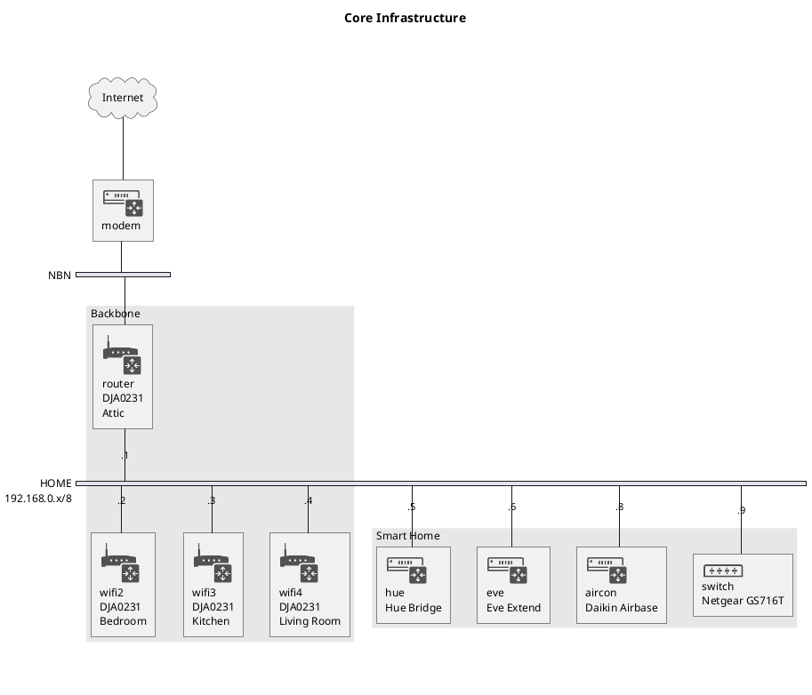
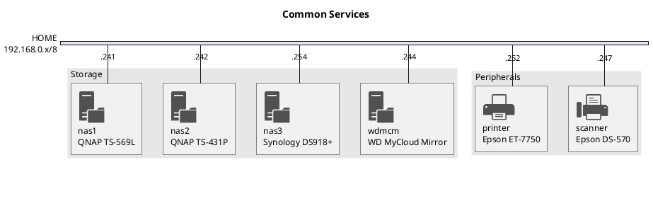

import Gallery from '../../../components/gallery.astro'
import Map from '../../../components/map.astro'

I have been a bit quiet lately, because I have been focusing on finishing up
the rewrite of this site.

I've always wanted to have a personal web site, but working full time meant that
I've never been able to really devote any significant time towards either
creating or maintaining an extensive personal web site.

## The Early Years

My first attempt in the 1990s was written in pure HTML and deployed on my
ISP web server. It contained not much more than my resume (at the time).

I remembered it was quite tedious hand crafting HTML using a text editor and
wished there was a better way of doing it.

When Microsoft released FrontPage, I started using it. Finally, I was able
to create web pages using a familiar word processor like user interface.

Unfortunately, I quickly realised the HTML pages generated by Microsoft
FrontPage contained lots of non standard HTML and it was difficult deploying
them on standard web servers or browsing on anything but Internet Explorer.

I then stumbled on Macromedia Dreamweaver, which allowed me to edit web pages
using a text editor like interface, but has live preview so I can easily see
what the results looked like. I liked this approach, as I was in full control
of what the generated pages looked like, but I was back to hand crafting HTML.
It was slightly easier, but not much easier.

## WordPress

Fast forward to many years later (around 2017). I was trying to create my
company's web site - [Hello Tham](https://hellotham.com). I heard that the
majority of the world's web sites run on something called
[WordPress](https://wordpress.org) - I figured I may as well use what everyone
was using.

In addition to creating my company website, I created the first version of this
site and hosted it on Hostgator, a US based web hosting service.

I must admit - although it is easy to set up a WordPress site, and relatively
easy to find hosting options, making a website that has all the functionality I
want and the design that I want turned out to be an exercise in frustration.

This is the Wordpress version of this site:


## Requirements

```markmap
---
markmap:
  zoom: false
  pan: false
---
# Requirements
- easy to create content
- display photo galleries with lightbox
- display map
- math equations
- diagrams
- custom design
```

I was ambitious - I wanted a website that can display photo galleries with a
lightbox:

<Gallery folder='2022-05-05-mt-tomah' />

I wanted the ability to display a map:

<Map text='Sydney Opera House' loc={[-33.85712, 151.215]} zoom={17} />

I wanted to be able to type mathematical equations like the
Black-Scholes option pricing formulae:

$$C(S_{t},K,t)=S_{t}\Phi (d_{1})-Ke^{-r(T-t)}\Phi (d_{2})$$

$$P(S_{t},K,t)=Ke^{-r(T-t)}\Phi (-d_{2})-S_{t}\Phi (-d_{1})$$

$$d_{1}=\frac{\ln \frac{S_{t}}{K} + (r + \frac{\sigma^2}{2})\tau}{\sigma\sqrt{\tau}}$$

$$d_{2}=d_{1}-\sigma\sqrt{\tau}$$

I also wanted the ability to draw diagrams (a representation of our Home Network):





And finally I wanted to be able to specify my own design colours - I came up
with a design palette that I call "Rosely":


All this was possible, but was hard work. WordPress is written in a language
called PHP, and all the content is stored in a database. The moment I wanted
to customise the design and functionality, I am dealing with the complexities
of a three tier client/server application (HTML/CSS/Javascript on the browser
tier, PHP on the app tier and SQL on the database tier). Whilst a lot of the
functionality I wanted can be obtained from the WordPress ecosystem (via
themes and plugins), integrating all these components require a lot of effort
and in the end I still didn't get exactly what I wanted.

There was no choice. I had to find a different solution. And that probably
meant learning how to do REAL web development, by actually coding a web site.
I had to learn HTML, CSS, Javascript, and goodness knows what else.

## Alternatives

I already kind of knew Python, so my first idea was to perhaps leverage a
high level language to write the majority of the web site functionality, and
then use pure HTML/CSS for the user interface.

Some alternatives I considered were Python, C#/ASP.NET, Go, and a few others
(I briefly considered Rust). I quickly realised all of these were not
feasible - they involved too much learning on my part, and at the end creating
a web app on any of these languages was just too difficult. Not only do I
have to figure out how to do web development on that language, I have a find
a server to host the code, or compile into WASM. And at the end of the day,
I still have to deal with HTML, CSS and Javascript on the front end, but I
now also had to figure out how to integrate between a high level language and
the guts of a browser domain object model. It was way beyond my limited
coding abilities.

I spoke to many experts over 2018 and 2019 - at Apple, AWS, Microsoft and
attended many technical meetups. I had access to these people from my job
as a management consultant. I even attended the PyCon and WordCamp conferences
to talk to attendees and speakers.

All of them told me the same thing: if I wanted to do a web site, I should
just bite the bullet and learn HTML, CSS and Javascript. Everything else is
a magnitude higher in terms of learning and complexity.

But I also learnt that the world of web development is changing, and changing
fast. The "traditional" way of creating a web site was to use a three
tier client/server application like WordPress (or its many competitors like
Wix, Squarespace, Medium or Ghost). Or just give up and post on social media.

But increasingly, people are talking about a "serverless" and statically
deployed architecture for web sites. This is partly driven by Google's new
Page Ranking algorithm deployed in 2020 which uses a site's performance to
determine it's search ranking and priority. Suddenly, having a high performing
web site has become important, and client server web sites in WordPress or
similar tools can be very slow and bulky.

I started reading about this whole new world of Javascript web frameworks,
serverless and the idea of a [Jamstack](https://jamstack.org) architecture.

In 2020, taking advantage of the COVID-19 lockdown, I learnt React, Gatsby,
then NextJS. I also started playing with CSS frameworks like Bootstrap, Bulma
and Tailwind. Finally I started playing with Markdown and MDX, and it seemed
to me that the best solution is a website where I can create content in
Markdown, and it uses a static site generator to then deploy my website to
any of the static web providers, like Vercel, Netlify, or Cloudflare.

In 2021, I also played with non Javascript static site generators like Hugo
and Jekyll. However, I found it difficult to master the templating syntax
required, and the limitations they impose on the functionality I required.
Still, I prototyped Jekyll and Hugo versions of my website.

## The new design and architecture

In 2022 a new framework called [Astro](https://astro.build) was released.
I quickly became intrigued,
it was a lot easier than the other frameworks, and has zero runtime. It
allowed me to code in Typescript (a version of Javascript with strong typing),
HTML and CSS, and generate a completely static web site that I can deploy
anywhere. In particular, I can deploy to Github Pages and not incur any cost
or have dependencies on a third party provider, since my code is already
stored on Github.

There was a catch, though. To deploy to Github Pages, the entire source code
for my web site needs to be public. I have no issues with this, as I am
creating a publicly accessible personal web site, so all the information
can be scraped off anyway, so I have no issues making the code open source.

I prototyped my web site and called it
[Hello Astro](https://github.com/hellotham/hello-astro) and eventually
released it as a public template. I did all the design using
[TailwindCSS](https://tailwindcss.com) leveraging off ideas I could find on the
Internet. I integrated [PhotoSwipe](https://photoswipe.com) to display
photo galleries with a lightbox, and also integrated
[Mermaid](https://mermaid.js.org/), [PlantUML](https://plantuml.com/) and
[MarkMap](https://markmap.js.org/) for diagrams. Finally I integrated
client side search using [Lunr](https://lunrjs.com/),
[KaTeX](https://katex.org/) for displaying math equations and
[Leaflet](https://leafletjs.com) to display maps using OpenStreetMap.
I finally had
all the functionality I've always wanted for a web site.

I was surprised that a few other people started using my template as well.
Two people even sponsored me on Github, even though the template is open
source and freely downloadable. I received a few comments on Twitter.

I finally started creating the new site, which is published as a Github
repository called
[christinetham.github.io](https://github.com/ChristineTham/christinetham.github.io)
in September 2022. By November, I had a working website, but little or no
content. I did manage to move all the content from my WordPress website, but
there wasn't a lot, a few articles here and there.

## Populating the website

For the last 6 months, I have been busy populating my web site by copying
posts from Facebook (from late 2021 onwards) and all the photos I have been
taking.

This has been a massive effort. The Sydney COVID-19 lockdown ended around
October 2021, and since then there has been an explosion of social activity.
I have made many new friends, eaten many meals together, and gone on various
trips. In hindsight, it has been a very busy 2022 and 2023, with not much
time for updating the web site.

But I have finally done it, and today, you can browse hundreds of posts from
2022 and 2023 and realise how busy I have been.


For the last few weeks, I have been putting final touches on my website, and
solving a few technical problems. There is functionality on the web site that
relies on a feature introduced in Astro 2.5.0 only a few days ago (the ability
to do cross references between collections with referential integrity). I've
also had to finalise doing all the SEO metadata (in particular, Schema tags)
and try to generate a comprehensive RSS feed.

I am finally calling it a day, and declaring today, Sunday 21 May 2023, as
the "official" launch day for the new website (although it has been live
since September 2022). I hope you enjoy the new web site and I hope to add
content from time to time. I also eventually hope to add content prior to
2021 all the way back to as much content as I can find.

Our travel blog is still in the process of being populated with trips we have
made in previous years and I hope to make an announcement about that soon.
